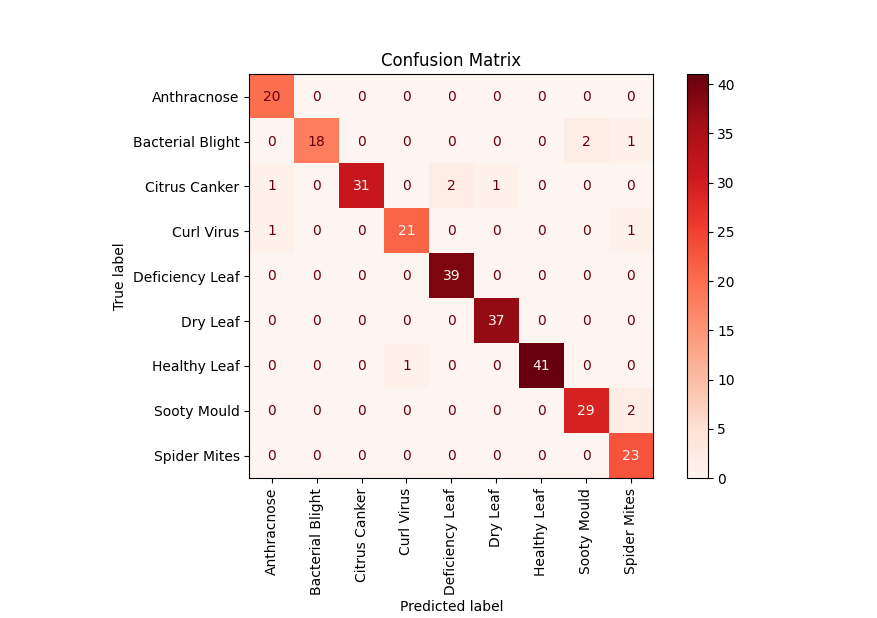

# Evaluation and Metrics

## Binary Model

This model is supposed to tell if a given image is of a Lemon Leaf or not.

Trained using **Transfer Learning** on **MobileNetV2** for **3 Epochs**.

| Metric    | Performance |
|-----------|-------------|
| Accuracy  | 1.00        |
| Precision | 1.00        |
| Recall    | 1.00        |
| F1-Score  | 0.99        |

## Main Model

This model is supposed to classify images of Lemon Leaves into Healthy Leaves and of 8 type of diseased leaves.

It also uses **MobileNetV2** as a base model for **Transfer Learning** and is trained for **15 Epochs**.

| Metric    | Performance |
|-----------|-------------|
| Accuracy  | 0.96        |
| Precision | 0.95        |
| Recall    | 0.95        |
| F1-Score  | 0.95        |
